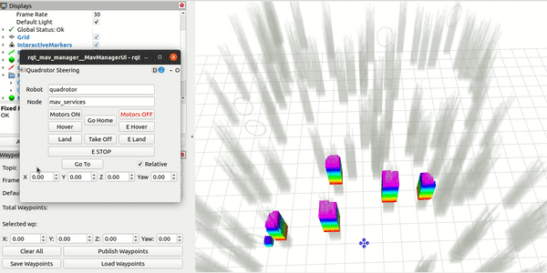
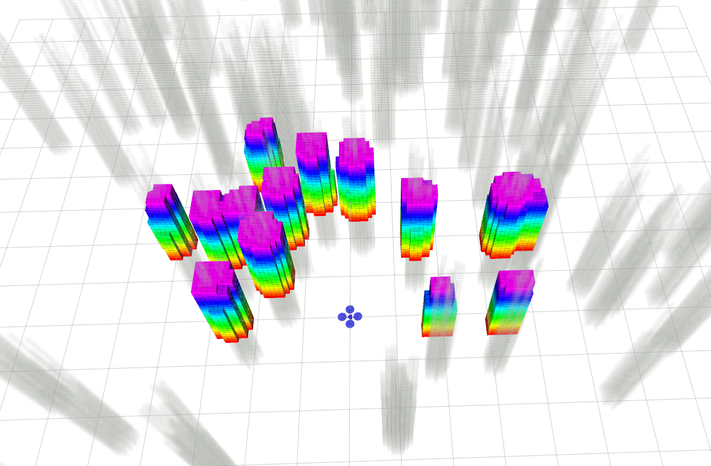

# Fast-Planner 

This is the revised version on Ubuntu 20.04/ROS noetic, which can work with the controller here: https://github.com/KumarRobotics/kr_mav_control

Independent planning module, code revised from fast planner: https://github.com/HKUST-Aerial-Robotics/Fast-Planner


Clone the repo and complie it:

```console
$ git clone -b kr git@github.com:yuwei-wu/Fast-Planner.git
$ wstool init && wstool merge Fast-Planner/fast.rosinstall && wstool update
$ cd ..
$ catkin build
```

To run the code:

terminal 1:

```
roslaunch plan_manage  rviz.launch

```
terminal 2:

```
 roslaunch plan_manage  fast.launch sim:=true vicon:=false mav_name:=quadrotor random_map:=true
```

terminal 3:

```
rosrun rqt_mav_manager rqt_mav_manager

```


notice: 
1. you should keep null_tracker to run fast planner.
2. you would better to disable the "MAVManager::setPositionCommand" or it may have issue when reaching to the goal point.




* you can adjust the number and size of random maps with p\_num and c\_num in fast.launch. The default is set as cylinders.

